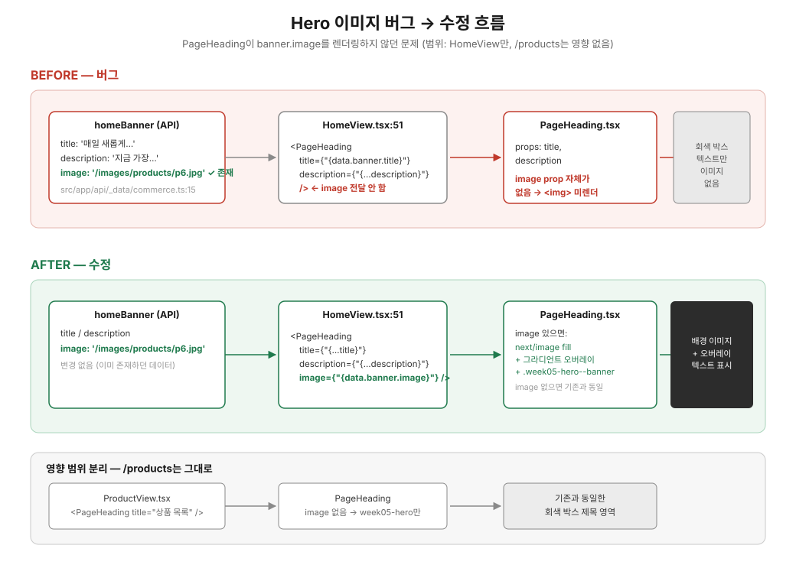

# Week 07 — Hero 이미지 미표시 버그 수정안

## 문제

홈 화면 상단 배너(hero)에 이미지가 보이지 않고 회색 박스와 텍스트만 표시된다.

## 진짜 원인

경로 오타 같은 단순 버그가 아니라, **화면이 실제로 쓰는 컴포넌트가 애초에 이미지를 렌더링하지 않는 것**이 원인이다.

- 홈 화면(`HomeView.tsx:51`)은 `src/shared/ui/PageHeading/PageHeading.tsx`를 사용한다.
- `PageHeading`은 `title`/`description`만 받고 ``(또는 `next/image`)를 렌더링하는 코드가 처음부터 없다.
- 반면 API 데이터(`src/app/api/_data/commerce.ts:15`)의 `homeBanner`에는 이미 `image: '/images/products/p6.jpg'`가 있고, 실제 파일도 `public/images/products/p6.jpg`에 존재한다.

즉 **UI가 이미 있는 데이터를 안 쓰고 있던 것**이 원인이다.

## 수정 계획

`PageHeading`은 홈 화면 외에 `/products`(`ProductView.tsx`)에서도 이미지 없이 재사용 중이므로, **이미지 관련 변경이 `/products`에 영향을 주지 않도록 스코프를 제한**한다.

1. **`PageHeading.tsx`**
   - `image?: string` prop 추가
   - `image`가 있을 때만 `next/image`(`fill`, `priority`)로 배경을 렌더링하고, 텍스트 가독성을 위한 어두운 그라디언트 오버레이를 추가
   - `image`가 있을 때만 `week05-hero--banner` modifier 클래스를 붙인다 (기존 `week05-hero` 단독 사용처인 `/products`는 그대로 유지)
2. **`layout.css`**
   - `.week05-hero--banner`, `.week05-hero-image` 규칙만 새로 추가하고 기존 `.week05-hero`는 건드리지 않는다
3. **`HomeView.tsx:51`**
   - `<PageHeading ... image={data.banner.image} />`로 실제 배너 데이터를 연결
4. **`PageHeading.test.tsx`**
   - `image` prop이 있을 때 배경 이미지가 렌더링되는 케이스 추가

## 영향 범위

| 변경 파일         | `/` (Home)                 | `/products`                           |
| ----------------- | -------------------------- | ------------------------------------- |
| `PageHeading.tsx` | `image` 있음 → 배경 렌더링 | `image` 없음 → 기존 동작 그대로       |
| `layout.css`      | 새 modifier 클래스 적용    | 기존 `.week05-hero` 그대로, 변경 없음 |

## 검증 방법

- `pnpm test`로 `PageHeading.test.tsx` 통과 확인 (기존 3개 + 신규 image 케이스)
- `pnpm dev`로 홈 화면에서 배너 이미지 정상 표시 확인
- `/products` 화면이 이번 변경 전후로 픽셀 단위로 동일한지 육안 확인
